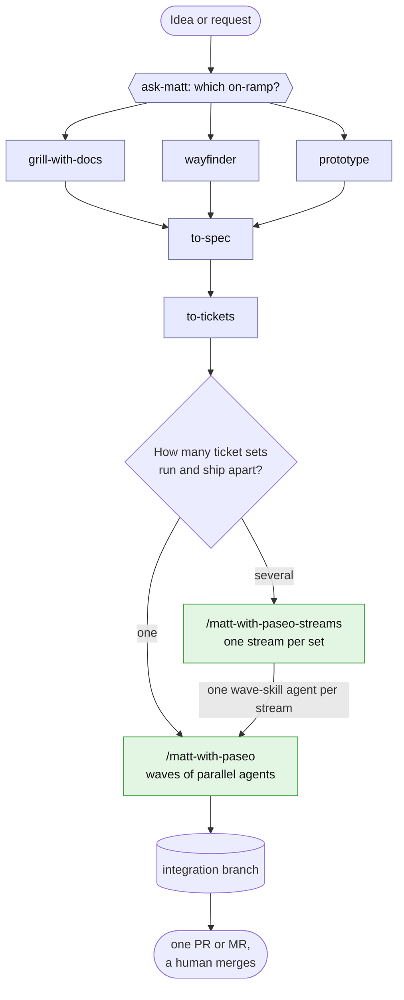
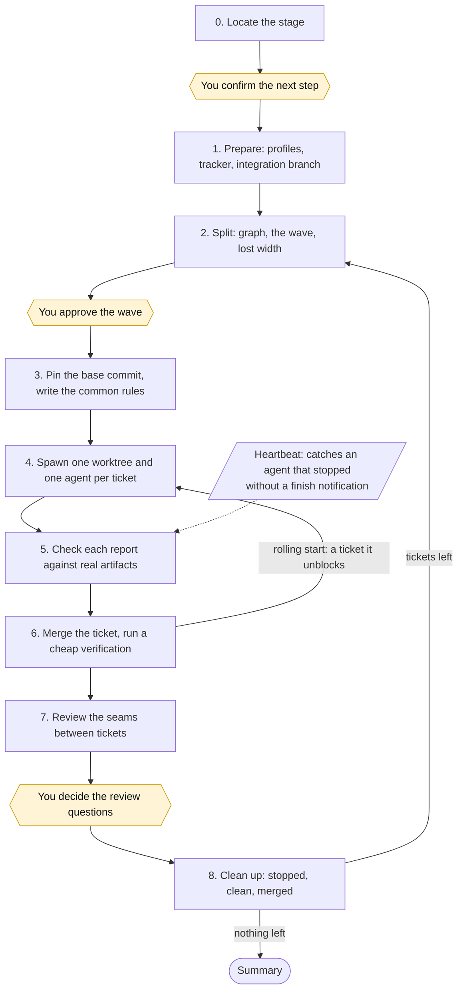
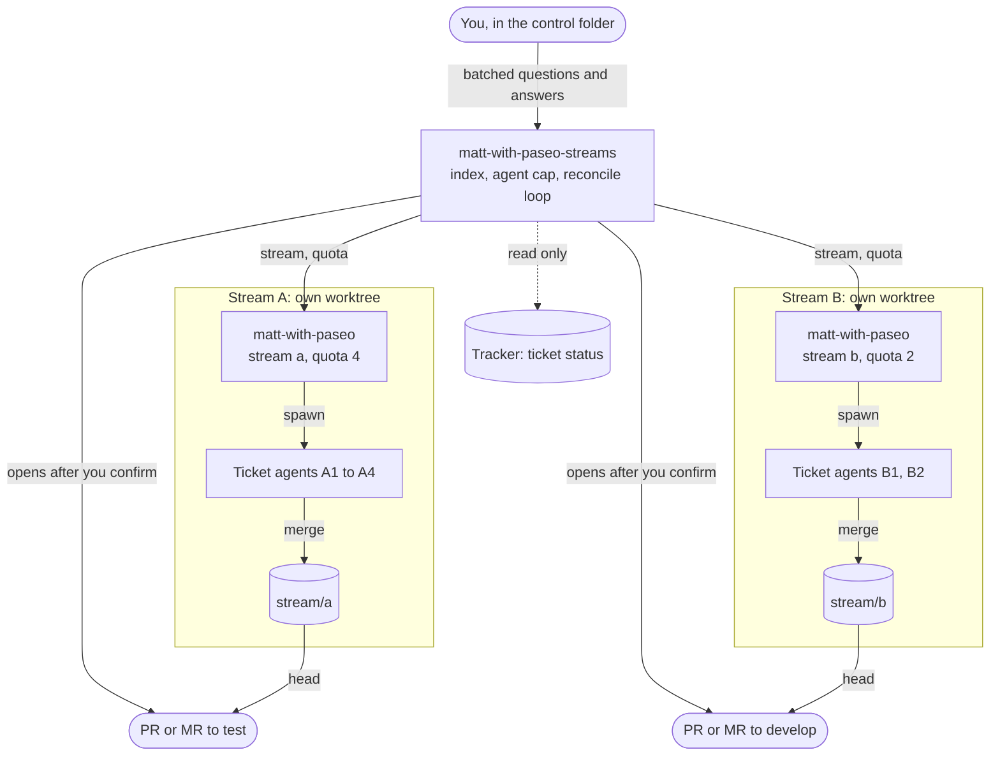
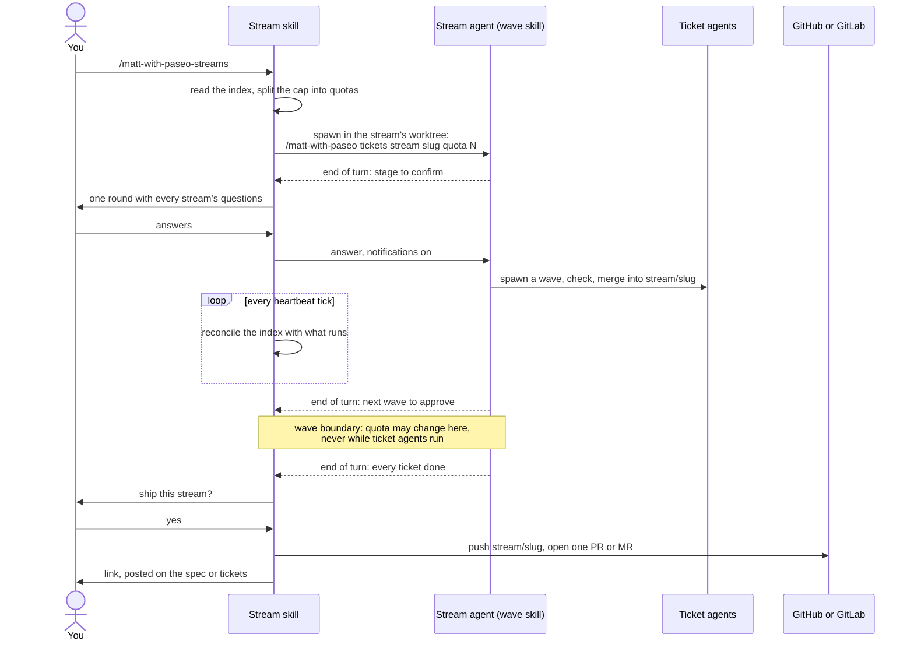

# matt-with-paseo

A simple multi-agent orchestrator for Claude Code. It combines [Matt Pocock's skills](https://github.com/mattpocock/skills) (grill, spec, tickets, TDD, code review) with [Paseo](https://paseo.sh), a control plane for running many coding agents at once.

You write the tickets with Matt's skills. `matt-with-paseo` runs them in **waves**: every ticket gets its own Paseo agent in its own git worktree, and the orchestrator merges, reviews, and cleans up before starting the next wave. When several ticket sets must run and ship on their own at once, a second skill, `matt-with-paseo-streams`, runs each set as a **stream** from one control folder (see [Streams](#streams-many-ticket-sets-at-once)).

## Why

Matt Pocock's skills take a feature from a vague idea to a set of small, dependency-ordered tickets. Running those tickets is still sequential by default: `/mattpocock-skills:implement` works through them one at a time in a single session.

Paseo can run many agents in parallel, each in its own worktree. What it does not know is which tickets are safe to run together, what each agent needs to be told, or how to check and merge the results.

`matt-with-paseo` fills that gap with the wave skill:

- It **locates** where your work stands (not configured, no spec yet, spec, tickets, a wave in progress, finished) and suggests one next step.
- It **names** a wayfinder map as a set of decision tickets not yet through `/mattpocock-skills:to-spec`, and starts no wave on it.
- It **splits** tickets into waves from their `Blocked by` lines, so only independent tickets run side by side.
- It writes one **common rules** file per wave, so every agent gets the same context and each prompt stays four lines long.
- It **checks** each agent's work against the real artifacts (commits, ticket status, a re-run of the key claim) instead of trusting the report.
- It **merges** each ticket as soon as it checks out, **starts** the tickets that merge unblocks, reviews the **seams** between tickets, then **cleans up** worktrees and agents only when that is safe.

The wave file doubles as a log, so a new session can pick up a half-finished wave where the last one stopped.

## How it works



Blue boxes are Matt's skills, typed by you; green boxes are this plugin's two skills.

Work reaches the wave skill through one of two equal on-ramps, `/mattpocock-skills:grill-with-docs` or `/mattpocock-skills:wayfinder`, which both merge at `/mattpocock-skills:to-spec`. The route up to the spec is Matt's, not this skill's: when there is no spec and no tickets yet, the skill sends you to `/mattpocock-skills:ask-matt` to pick the skill that fits, and stops. A wayfinder map is a set of decision tickets, not yet through `/mattpocock-skills:to-spec`, so the skill names it and starts no wave on it.

Each run then locates the current stage from what the tracker holds:

| Stage | Signal in the repo | Suggested next step |
|---|---|---|
| A. Not configured | no `## Agent skills` section pointing to an issue tracker | `/mattpocock-skills:setup-matt-pocock-skills` |
| B. Spec, no tickets | a spec exists, no tickets for it | `/mattpocock-skills:to-tickets`, in the session that wrote the spec |
| C. Tickets, no wave yet | tickets exist, no `wave*-common-rules.md` | start wave 1 |
| D. N waves done, tickets left | earlier waves finished, some tickets still open | build the graph again for the next wave |
| E. Wave in progress | a wave file with unfinished tickets | resume the missing step |
| F. Finished | every ticket `resolved` or in the ready for human role | summary |

Once the tickets exist, come back to this skill rather than Matt's `/mattpocock-skills:implement-spec`.

Each wave then goes through the same loop:



Yellow boxes are the decisions that stay yours.

1. **Prepare**: read Paseo profiles, the ticket tracker, and the integration branch. The branch is read with `git branch --show-current`, never from the directory name (the rule in step 1 of `SKILL.md`).
2. **Split**: draw the dependency graph and put every ticket that can run now into the wave. It also lists what is costing width (a ticket waiting on a human, a `Blocked by` that is only a shared file) with the one question that would unblock it. You approve it.
3. **Common rules**: pin a base commit and write `wave<N>-common-rules.md` from the template.
4. **Spawn**: one worktree and one agent per ticket. Symptom tickets run `mattpocock-skills:diagnosing-bugs` then `mattpocock-skills:tdd`; behaviour tickets run `mattpocock-skills:tdd`. Every flow ends with `mattpocock-skills:code-review`, as `/mattpocock-skills:implement` does.
5. **Check**: verify each report against commits, ticket status, and a re-run of its key claim.
6. **Merge**: one `--no-ff` merge per ticket as soon as its report is checked, with a cheap verification after each; any ticket that merge unblocks starts right away in the same wave (rolling start).
7. **Review the seams**: for waves of two or more tickets, one `mattpocock-skills:code-review` pass over where the tickets touch; findings go back to the owning agent or get fixed on the integration branch.
8. **Clean up**: archive agents and worktrees that are stopped, clean, and merged; then open the next wave.

The wave skill asks for your approval at the decisions that are yours: the stage and next step, the wave plan, and any question a review raises.

## Streams: many ticket sets at once

A **stream** is one ticket set that ships through one integration branch and one pull request. Use the wave skill alone when you run one ticket set from its own checkout. Use the stream skill, `matt-with-paseo-streams`, when you run several ticket sets at once, often in one repository, and each must ship on its own: work for several requesters, or an independent bug that should not wait for an unrelated feature. Unrelated work that ships separately becomes separate streams. Streams never depend on each other: a ticket that waits on another belongs in the same stream.

The stream skill gives each stream one worktree on its own integration branch, `stream/<slug>`, cut from the stream's base branch, and one Paseo agent there that runs the wave skill. It brings you every question from every stream in one batched round, verbatim, and never answers for you. A heartbeat reconciles the index with what is running, restarting a failed stream agent without touching the other streams. After each wave it warns you when two streams in one repository change the same file, and never blocks. When a stream's tickets are all done, it asks you, and only after you confirm does it push the integration branch and open one pull request per stream (a merge request on GitLab) to the stream's target, with a description written with `mattpocock-skills:pr` and a link posted on the stream's spec or tickets. It never merges: that stays with the repository's reviewers.

### How the stream skill runs



The stream skill talks only to stream agents, never to ticket agents, and reads only public signals. Streams share no dependencies, so nothing connects A and B.

One stream, from start to shipping:



### The control folder and its index

The stream skill is user-invoked only, like the wave skill, and runs from a **control folder** outside every repository: create an empty folder, open a Claude Code session in it, and type `/matt-with-paseo-streams` (`/matt-with-paseo:matt-with-paseo-streams` with the plugin install), or `/matt-with-paseo-streams <slug>` for one stream.

The index is `streams.md` at the root of that folder. With no index yet, the skill writes it and asks you for its fields:

- the **agent cap**, above the table: the most agents running at once across every stream;
- one row per stream: its slug, the absolute path of a local checkout of its repository, its owner, where its tickets live (a folder for a local-markdown tracker; a label or a parent spec issue for GitHub or GitLab), its base branch, its pull-request target, its priority, and a status line the skill keeps current.

An empty base branch or target falls back to the default the target repository declares next to its `## Agent skills` section, then to the remote's default branch. A base branch that gathers several people's unfinished work, such as a shared `test` branch, draws a warning, never a block. The index only says where each stream's tickets live; the tracker stays the one source of truth for them. The field table and an example are in [The index](plugins/matt-with-paseo/skills/matt-with-paseo-streams/SKILL.md#the-index).

**How the cap is split.** Each running stream uses one slot for its stream agent plus its quota, the number of ticket agents it may run at once. Streams take slots in priority order, first come first served by default, so a cap below 2 runs no stream. A stream left without room waits on the cap and starts at a later wave boundary; a running wave is never cut for capacity.

### The two wave-skill arguments

The stream agent runs the wave skill with two optional arguments, which you can also type yourself:

```
/matt-with-paseo <feature name or ticket folder> stream <slug> quota <N>
```

- `stream <slug>` puts the slug into every label, ticket branch name and private resource name the run creates, so two runs in one repository never collide.
- `quota <N>` caps the ticket agents the run lets run at once.

The wave skill runs in a checkout of its integration branch, whoever calls it. Without `stream` it behaves exactly as in 0.3.0; without `quota` a wave takes every ticket that can run.

## Requirements

Claude Code only: the skills need a shell, git and the Paseo MCP server. What the plugin runs and sends is listed in [the plugin README](plugins/matt-with-paseo/README.md#what-the-plugin-runs).

- [Claude Code](https://claude.com/claude-code)
- [Paseo](https://paseo.sh), with its MCP server available to the orchestrating session and its `paseo` skill installed
- [Matt Pocock's skills](https://github.com/mattpocock/skills), installed as the `mattpocock-skills` Claude Code plugin. Both skills suggest commands in the plugin's namespaced form, `/mattpocock-skills:<skill>`; if you installed Matt's skills another way, type the same skill without the prefix (`/<skill>`).
- A git repository whose tracker is configured by `/mattpocock-skills:setup-matt-pocock-skills`

### Target repo `paseo.json` (optional)

If the target repo commits a `paseo.json`, the wave skill uses it when spawning: with `worktree.setup` declared, it stops pasting environment setup into agent prompts; with services declared, it stops assigning ports and relies on the port Paseo gives each worktree. Neither skill writes `paseo.json`; the target repo owns it. Notes for whoever maintains that file:

- Do not declare a fixed `port` on a service. Every worktree then gets the same port; on Windows the processes all bind it without error, a worktree's proxy URL serves another worktree's files, and `health` still reports healthy. Leave `port` out and read the assigned one from `PASEO_PORT`.
- On Windows, `worktree.setup` runs in Windows PowerShell, while `scripts` and terminals run in cmd. The sh form `$VAR` used in the Paseo docs fails silently in both: it expands to nothing in PowerShell and stays literal in cmd. Use PowerShell syntax in setup (`$env:PASEO_WORKTREE_PORT`) and cmd syntax in scripts (`%PASEO_PORT%`).

### Target repo evidence standards file (optional)

If the target repo has its own standard for proving a change works (measure on real data, attach a recording of the screen, run a command twice and compare the counts), write it as free prose in a file, for example `docs/agents/evidence-standards.md`, and declare it in an `## Evidence standards` section of `CLAUDE.md` or `AGENTS.md` that points to that file. Put the section **outside** the `## Agent skills` block: `/mattpocock-skills:setup-matt-pocock-skills` rewrites that block in place and would drop anything added inside it.

The wave skill reads the file while preparing a wave, points every agent to it from the common rules instead of copying it, and names it in every `mattpocock-skills:code-review` call, because the review's Standards axis reads only documents on how code is written (such as `CODING_STANDARDS.md`) on its own. The file is about how to prove a change works, so keep it separate from those. A repo without the section runs exactly as before.

## Installation

The plugin lives in [`plugins/matt-with-paseo/`](plugins/matt-with-paseo/), which follows the [Agent Skills](https://agentskills.io/specification) layout (`plugins/matt-with-paseo/skills/matt-with-paseo/SKILL.md`, `plugins/matt-with-paseo/skills/matt-with-paseo-streams/SKILL.md`), and the repo root is a Claude Code plugin marketplace that lists it, so any of these works. Only that folder is installed: design notes, ADRs and scripts stay in the repo. Every option installs both skills side by side, since the stream skill points to files of the wave skill's folder. Pick one; installing twice gives you two copies of each command.

### Option 1: Claude Code plugin

```
/plugin marketplace add hanh9898/matt-with-paseo
/plugin install matt-with-paseo@matt-with-paseo
```

Updates arrive through `/plugin marketplace update`. Plugin skills are namespaced, so the commands are `/matt-with-paseo:matt-with-paseo` and `/matt-with-paseo:matt-with-paseo-streams`.

### Option 2: `npx skills`

```bash
npx skills add hanh9898/matt-with-paseo --skill '*' -g -a claude-code
```

`--skill '*'` takes both skills; `-g` installs for your user; drop it to install into the current project. The commands are `/matt-with-paseo` and `/matt-with-paseo-streams`.

### Option 3: GitHub CLI (v2.90+)

```bash
gh skill install hanh9898/matt-with-paseo --all --agent claude-code --scope user
```

`--all` takes both skills. This resolves the latest tagged release; add `--pin v0.4.1` to fix a version. The commands are `/matt-with-paseo` and `/matt-with-paseo-streams`.

### Option 4: Manual copy

macOS / Linux:

```bash
git clone https://github.com/hanh9898/matt-with-paseo.git
cp -r matt-with-paseo/plugins/matt-with-paseo/skills/matt-with-paseo matt-with-paseo/plugins/matt-with-paseo/skills/matt-with-paseo-streams ~/.claude/skills/
cp matt-with-paseo/plugins/matt-with-paseo/.claude-plugin/plugin.json ~/.claude/skills/matt-with-paseo/
cp matt-with-paseo/plugins/matt-with-paseo/.claude-plugin/plugin.json ~/.claude/skills/matt-with-paseo-streams/
```

Windows (PowerShell):

```powershell
git clone https://github.com/hanh9898/matt-with-paseo.git
Copy-Item -Recurse matt-with-paseo\plugins\matt-with-paseo\skills\matt-with-paseo, matt-with-paseo\plugins\matt-with-paseo\skills\matt-with-paseo-streams "$env:USERPROFILE\.claude\skills\"
Copy-Item matt-with-paseo\plugins\matt-with-paseo\.claude-plugin\plugin.json "$env:USERPROFILE\.claude\skills\matt-with-paseo\"
Copy-Item matt-with-paseo\plugins\matt-with-paseo\.claude-plugin\plugin.json "$env:USERPROFILE\.claude\skills\matt-with-paseo-streams\"
```

The last two copies put the plugin manifest next to each skill, so a hand-installed copy carries its version: read the `version` field of `plugin.json` in either skill folder to see which release you run. To use them in one project only, copy both skills into that project's `.claude/skills/` and the manifest into each of their folders instead. The commands are `/matt-with-paseo` and `/matt-with-paseo-streams`.

## Usage

In a Claude Code session inside your repository (with the plugin install, use `/matt-with-paseo:matt-with-paseo`):

```
/matt-with-paseo
/matt-with-paseo <feature name or ticket folder>
```

Both skills are user-invoked only (`disable-model-invocation: true`): the wave skill starts agents and merges branches, the stream skill starts agents and opens pull requests, so each runs when you ask for it. The stream skill's command is in [The control folder and its index](#the-control-folder-and-its-index).

Files it writes, next to your ticket folder:

- `wave<N>-common-rules.md`: the rules every agent of wave N reads, followed by the wave's agent table and review log.

The stream skill writes one file, in its control folder:

- `streams.md`: the index, the agent cap and one row per stream with its status line.

Files in this repo:

| File | Purpose |
|---|---|
| [`plugins/matt-with-paseo/skills/matt-with-paseo/SKILL.md`](plugins/matt-with-paseo/skills/matt-with-paseo/SKILL.md) | The orchestrator: locate, then steps 1 to 8 |
| [`plugins/matt-with-paseo/skills/matt-with-paseo/COMMON-RULES-TEMPLATE.md`](plugins/matt-with-paseo/skills/matt-with-paseo/COMMON-RULES-TEMPLATE.md) | The frame for each wave's common rules |
| [`plugins/matt-with-paseo/skills/matt-with-paseo/TROUBLESHOOTING.md`](plugins/matt-with-paseo/skills/matt-with-paseo/TROUBLESHOOTING.md) | Symptoms and fixes for stopped agents, merge conflicts, and cleanup |
| [`plugins/matt-with-paseo/skills/matt-with-paseo-streams/SKILL.md`](plugins/matt-with-paseo/skills/matt-with-paseo-streams/SKILL.md) | The stream orchestrator: the index, then steps 0 to 7 |
| [`.claude-plugin/marketplace.json`](.claude-plugin/marketplace.json) | The marketplace that lists the plugin |
| [`plugins/matt-with-paseo/`](plugins/matt-with-paseo/) | The plugin itself: its manifest, both skills, its listing README and license; the only folder an install copies |
| [`docs/adr/`](docs/adr/) | Architecture decisions behind the stream skill: streams share no dependencies, one wave-skill agent per stream, one integration branch per stream, the reconcile loop |
| [`scripts/`](scripts/) | The drift check against Matt's installed skills, and its tests |

## Design principles

- **Width first.** Parallel work is the point: each wave takes every ticket that can run, the orchestrator names what blocks the rest, and a ticket starts the moment its blockers merge.
- **Every step ends on a checkable "done when".** The orchestrator can tell finished from unfinished without judgement calls.
- **Check artifacts, not reports.** An agent's "all green" only covers what it checked.
- **Red before green.** A bug fix counts only if its test failed on the symptom before the fix.
- **Review per ticket, then the seams.** Each agent ends with `mattpocock-skills:code-review` before its last commit, as `/mattpocock-skills:implement` does; the orchestrator reviews only where tickets collide once merged, and skips that pass for one-ticket waves.
- **Nothing destructive without three checks.** A worktree is archived only when its agent has stopped, its tree is clean, and its branch is merged.
- **State lives on disk.** Ticket status and the wave file are enough for a fresh session to resume; for streams, the index and the agents' labels are.
- **Each layer talks only to the layer below it.** The stream skill prompts, restarts and archives stream agents, never ticket agents, and reads only public signals (tracker status, end-of-turn messages, agent status, git), never a wave file ([ADR 0002](docs/adr/0002-nested-orchestration-per-stream.md)).
- **Reconcile, do not just report.** The stream skill's heartbeat compares the index with what it observes and takes one idempotent action per gap, so a new session recovers by running one tick ([ADR 0004](docs/adr/0004-stream-heartbeat-is-a-reconcile-loop-with-supervision.md)).
- **Never archive a parent while its children run.** Archiving a Paseo agent archives its running child agents too (measured, probe C1), so a stream agent is replaced only when no ticket agent of its stream runs.

## Limitations

- Tested with Claude Code on one project. The stream skill has not yet had its end-to-end run with two streams in one repository. Other agent providers that Paseo supports should work as long as they can load Matt Pocock's skills, but have not been tried.
- Agents can only run model-invocable skills. A Matt skill whose `disable-model-invocation` frontmatter flag is `true` can only be typed by a human (the rule in step 4 of `SKILL.md`), so the orchestrator suggests it and you type it.
- The ticket tracker is whatever `mattpocock-skills:setup-matt-pocock-skills` configured; both skills read it but do not create one.

## Contributing

Issues and pull requests are welcome. Both skills follow Matt Pocock's [`mattpocock-skills:writing-for-agents`](https://github.com/mattpocock/skills) guidance, so a good change usually:

- adds a row to a table rather than a new prose branch (new agent flows go in the wave skill's step 4 flow table);
- gives every step a checkable completion criterion;
- moves material only some runs need into `TROUBLESHOOTING.md` or a new file behind a pointer, keeping `SKILL.md` short.

When a fix comes from a real incident, describe the symptom you saw in the pull request.

Before a release, run the drift check by hand (Python 3, standard library only):

```
python scripts/drift-check.py
```

It lists every `mattpocock-skills:<name>` reference in both skills (`plugins/matt-with-paseo/skills/matt-with-paseo/`, `plugins/matt-with-paseo/skills/matt-with-paseo-streams/`), the plugin's README and this README and compares each one with the Matt plugin installed on your machine, not with a pinned version: it reads the user-scope `mattpocock-skills` entry of `~/.claude/plugins/installed_plugins.json` (pass `--plugin-root <dir>` to compare against another copy). A reference fails when the plugin's manifest does not ship that skill, or when it sits in an agent flow (step 4 of the wave skill's `SKILL.md`, or anywhere in `COMMON-RULES-TEMPLATE.md`; the stream skill spawns only the wave skill, so it has none) and the skill sets `disable-model-invocation`. The check only sees prefixed names, so always name Matt's skills as `mattpocock-skills:<name>`.

| Exit | Output | Meaning |
|---|---|---|
| 0 | nothing | no stale reference |
| 1 | one line per stale reference | fix each line before releasing |
| 2 | one error line | the check could not run: no plugin found, or the wave skill's `SKILL.md` has no `## 4.` step |

Its tests: `python -B -m unittest discover -s scripts`.

### Behaviour evals

The plugin carries an eval suite for [`claude plugin eval`](https://code.claude.com/docs/en/plugin-evals) in `plugins/matt-with-paseo/evals/`. Each case builds a small repository with a fixture script, types one of the two commands, and grades what the skill decides: the locating step of the wave skill (not configured, no spec, a spec without tickets, tickets with width, a pure chain, a wayfinder map) and the stream skill's first run with no index. The runs are read-only, and Paseo's MCP server is not available inside an eval run, so the suite checks decisions, not spawning; the real multi-agent run is the acceptance run of #23. Every case also runs without the plugin, so the report shows what the plugin adds.

```
cd plugins/matt-with-paseo
claude plugin eval . --scaffold
```

`--scaffold` runs each case's `fixture.sh` as you, to build its repository; read them first. The first run in a directory asks you to trust the plugin, so start it from an interactive terminal; from a script, CI or an agent session, add `--trust-plugin` once you have read the suite. A full run is 7 cases, 3 runs each, in two arms (with and without the plugin). The last full run scored 1.00 with the plugin on every case, against 0.20 to 0.50 without it. Each fixture strips carriage returns before it runs, so a CRLF checkout on Windows works too.

## Acknowledgements

- [Matt Pocock](https://github.com/mattpocock) for the [skills](https://github.com/mattpocock/skills) this orchestrates (MIT).
- [Paseo](https://paseo.sh) for the agent control plane.

## License

[MIT](LICENSE)

Matt with Paseo is an independent project. It is not affiliated with or endorsed by Matt Pocock, Paseo, or Anthropic.
